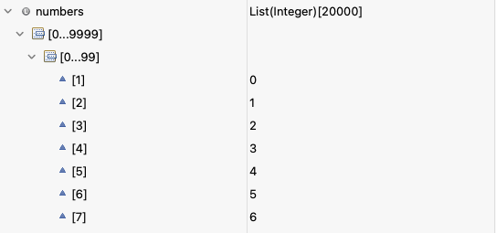
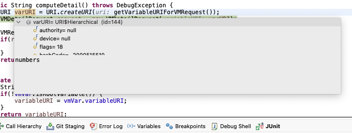
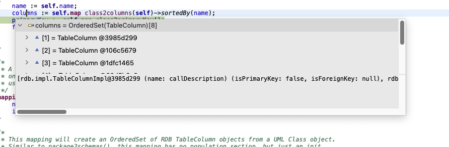
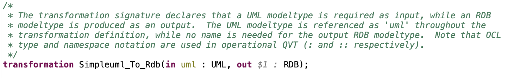
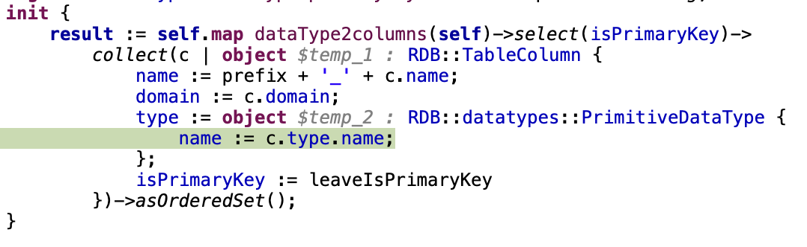
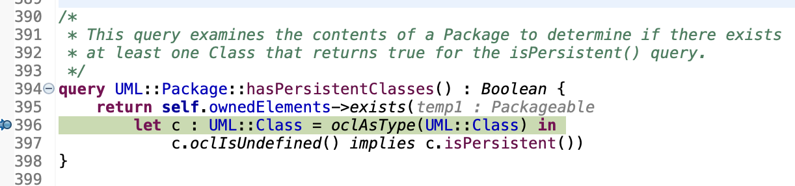
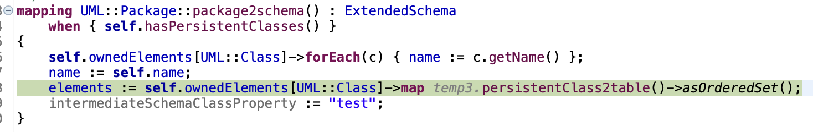

<!-- LTeX: language=de-DE -->

# Werkzeuge für agile Modellierung: Erweiterung des Funktionsumfangs eines Debuggers für Eclipse QVTo

Im Rahmen des Praktikums "Werkzeuge für agile Modellierung" wurde am Debugger von [Eclipse QVTo](https://github.com/eclipse-qvto/org.eclipse.qvto) entwickelt.
Hierbei wurden mehrere Probleme behoben und neue Features eingefügt.
Diese sind in den folgenden Abschnitten beschrieben.
Im letzten Abschnitt wird auf eventuelle zukünftige Arbeiten und bekannte Fehler eingegangen.

## Neue Funktionalitäten

In diesem Abschnitt werden die neuen Features vorgestellt, welche im Rahmen des Praktikums im QVTo-Debugger implementiert wurden.

### Hierarchiches Anzeigen großer Collections

Ein bereits im Issue-Tracker des QVTo Projekts bekanntes [Problem](https://github.com/eclipse-qvto/org.eclipse.qvto/issues/915) war, dass das Anzeigen der Elemente einer großen Collection lange gedauert hat, da alle Elemente auf ein Mal angezeigt wurden.

Im Rahmen des Praktikums wurde dieses Problem dadurch behoben, dass die Werte nun hierarchisch angezeigt werden.
Dies führt dazu, dass nicht mehr alle Elemente der Collection sofort geladen werden müssen, wodurch das Anzeigen schneller ist.
Außerdem wird die Ansicht der Elemente einer Collection dadurch übersichtlicher.
In anderen Eclipse Projekten, wie z.B. den Java Development Tools (JDT) wird dieses Problem ebenfalls so gelöst.



Das Debugger-Framework von Eclipse verwendet einen Baum zur Darstellung der Variablen.
Die Elemente dieses Baumes sind [`IVariable`](https://help.eclipse.org/latest/topic/org.eclipse.platform.doc.isv/reference/api/org/eclipse/debug/core/model/IVariable.html)s.
Auf jeder Variable kann mittels [`getValue()`](https://help.eclipse.org/latest/topic/org.eclipse.platform.doc.isv/reference/api/org/eclipse/debug/core/model/IVariable.html#getValue()) der Wert der Variable abgerufen werden.
Diese Werte sind vom Typ [`IValue`](https://help.eclipse.org/latest/topic/org.eclipse.platform.doc.isv/reference/api/org/eclipse/debug/core/model/IValue.html).
Es existiert ein Subinterface von `IValue` namens [`IIndexedValue`](https://help.eclipse.org/latest/topic/org.eclipse.platform.doc.isv/reference/api/org/eclipse/debug/core/model/IIndexedValue.html).
Dieses Interface beschreibt Werte, welche in Form von Collections mit Index vorliegen.
Wenn ein `IValue` dieses Interface implementiert stellt das Debugger-Framework von Eclipse diese Elemente automatisch hierarisch dar, sobald es zu viele sind.
Dieses Features des Debugger-Frameworks wurde in der Umsetzung genutzt, indem eine neue Unterklasse von `QVTOValue` namens `QVTOCollectionValue` erstellt wurde, welche `IIndexedValue` implementiert.
`QVTOValue` ist die im QVTo-Debugger verwendete Klasse für Werte im Debugger.
Die Klasse `QVTOVariable` repräsentiert Variablen im QVTo-Debugger und implementiert entsprechend `IVariable`.
In dieser Klasse wurde die `getValue()` Methode angepasst, sodass falls es sich um eine Variable handelt, die eine Collection repräsentiert, eine Instanz der Klasse `QVTOCollectionValue` erstellt wird.

### Debug Hover

Debuggt man in Eclipse ein Java Programm, so wird im Editor, wenn man über eine Variable hovert ein Popup mit dem Wert der Variable angezeigt.


Dieses Feature ist in JDT, nicht in der Eclipse Platform direkt, implementiert.
Im Rahmen dieses Praktikums wurde das Feature auch für den QVTo-Debugger implementiert.
Hierfür ist zusätzlich zu einer Anpassung der beiden Plugins, welche die Debugger-Funktionalität umsetzen auch eine Anpassung des Plugins für den Editor notwendig.

Im Editor gibt es bereits ein Popup, falls man über gewissen Elementen hovert.
Dieses zeigt z.B. den Namen samt Typ und, falls die Variable ein Feld einer Klasse ist, die Klasse an.
Die Informationen darüber, was im Popup angezeigt werden soll werden von Providern, welche das Interface `IElementInfoProvider` implementieren bereitgestellt.
Es war jedoch nicht möglich von außen weitere Provider hinzuzufügen.
Als erster Schritt wurde deshalb ein [Extension-Point](https://www.vogella.com/tutorials/EclipseExtensionPoint/article.html) eingeführt mit dem andere Plugins `IElementInfoProvider` zum Editor hinzufügen können.
Um sicherzustellen, dass die Debug Information immer angezeigt werden, falls diese verfügbar sind, wurde eine neue Methode `getPriority()` zu `IElementInfoProvider` hinzugefügt, mit welcher Provider optional ihre eigene Priorität als Integer angeben können.
Eine höhere Zahl bedeutet hierbei eine höhere Priorität.
Standardmäßig haben alle Provider die Priorität 0.

Um die Werte aus dem Debugger, wie in der Variables View, als Baum darstellen zu können wurde eine Methode `getHoverControlCreator()` in das Interface `IElementInfoProvider` eingefügt.
Diese Methode wird im Editor für die Implementierung der Methode [`ITextHoverExtension#getHoverControlCreator()`](https://help.eclipse.org/latest/topic/org.eclipse.platform.doc.isv/reference/api/org/eclipse/jface/text/ITextHoverExtension.html#getHoverControlCreator()) verwendet.
Mittels dieser Methode können die Provider einzeln festlegen, wie der Inhalt des Popups dargestellt werden soll.
Zuvor wurde der Inhalt immer als einfacher Text dargestellt.

Zuletzt wurde dann ein `IElementInfoProvider` im Debugger implementiert.
Dieser hat eine Priorität von 1, damit die Debug Informationen immer präferiert gegenüber den "normalen" Informationen angezeigt werden.
Dieser Provider versucht, falls über eine Variable gehovert wird, die entsprechende `QVTOVariable` zu finden, um diese im Popup darzustellen.
Für die Darstellung als Baum wird eine Instanz der Klasse `ExpressionInformationControlCreator` aus JDT verwendet, welche beliebige `IVariable`s, wie in der Variables View, als Baum im Popup darstellt.



### Anzeigen von temporärer Variablen im Editor

In der Variables Ansicht des Debuggers wurden teilweise Variablen angezeigt, die der Interpreter nur intern verwendet oder die implizit definiert oder benannt werden.
Innerhalb dieses Praktikums wurden die vorkommenden Variablen analysiert und verschiedene Anpassungen vorgenommen, um das Arbeiten mit diesen Variablen zu verbessern.
Diese Anpassungen bestehen darin entweder die Variable aus der Variables Ansicht auszublenden oder die Herkunft der Variable durch Code-Minings im Editor zu verdeutlichen.

Wenn Modelparameter der Transformation keinen explizit definierten Namen haben, wird ihnen ein Name der Form `$n`, wobei `n` eine aufsteigende Zahl ist, zugewiesen.
Definiert man z.B. die folgende Transformation:

```qvto
transformation Simpleuml_To_Rdb(in uml : UML, out RDB);
```

So erhält der `out` Parameter den Namen `$1`.
Diese Art von Variablen wird weiterhin in der Variables Ansicht angezeigt.
Hier wurde sich dafür entschieden den automatisch vergebenen Namen mittels eines Code-Minings im Editor so anzuzeigen, als hätte man den Namen selbst definiert.



Wenn ein neues Objekt mittels des `object` Keyword erstellt wird, wird für dieses neu erstelle Objekt eine temporäre Variable angelegt.
Der Name der Variable hat die Form `$temp_n`, wobei `n` wieder eine aufsteigende Zahl ist.
Die Zahl wird immer erhöht, sobald eine neue temporäre Variable benötigt wird.
Auch hier wurde sich wieder dafür entschieden die Variable weiterhin in der Variables Ansicht anzuzeigen und die Herkunft über ein Code-Mining im Editor zu verdeutlichen.



Bei Loop Expressions, wie z.B. `exists()` oder `collect()` wird eine temporäre Variable für das aktuell betrachtete Objekt erstellt, falls das Objekt nicht explizit benannt wurde.
Diese ist nach der Form `tempn` benannt, wobei n hier wieder eine aufsteigende Zahl ist.
Auch hier wird die Herkunft der Variable wieder durch ein Code-Mining im Editor an verdeutlicht.
Hierbei wird sowohl der Name als auch der Typ dargestellt.



Außerdem gibt es bei Loop Expressions eine automatisch erzeugte Variable, die das aktuelle Zwischenergebnis speichert.
Dies ist zum Beispiel bei `collect()` die Liste von bereits bearbeiteten Elementen.
Diese ist nach der Form `__result__n` benannt.
Hier wurde sich dafür entschieden diese Variable aus der Variables Ansicht auszublenden, da es keine gute Möglichkeit gab die Herkunft der Variable zu verdeutlichen.

Bei `map` Aufrufen kann es auch, ähnlich wie bei Loop Expressions, temporäre Variablen geben.
Eine für das aktuelle Element in der Form `tempn` und eine in der Form `__qvtresult__n` für das Zwischenergebnis.
Um diese Variablen überhaupt im Debugger angezeigt zu bekommen ist es nötig ein Breakpoint auf einer Zeile mit `map` Aufruf zu setzen, z.B.:

```qvto
elements := self.ownedElements[UML::Class]->map persistentClass2table()->asOrderedSet()
```

Dann muss man mittels "Step Into" erst in das aufgerufene Mapping steppen und dann wieder mittels "Step Return" aus dem Mapping züruck zum Aufruf steppen.
Dies ist der Fall, da ein Breakpoint auf einer Zeile immer vor der Ausführung der Zeile gesetzt ist.
Hier wurde sich wieder, wie bei den Loop Expressions, dafür entschieden die temporäre Variable für das aktuelle Element mittels eines Code-Minings im Editor anzuzeigen.
Die temporäre Variable für das Zwischenergebnis wurde wieder ausgeblendet, da es auch hier keine gute Möglichkeit gab die Herkunft der Variable zu verdeutlichen.



Sobald in der Transformation eine Intermediate Class definiert wird, wird in der Variables Ansicht immer eine Variable namens `_intermediate` angezeigt.
Diese enthält alle Instanzen von Intermediate Classes, die während des Ausführens der Transformation erstellt wurden.
An den Stellen, an denen eine Intermediate Class verwendet wird, wird dies auch bereits korrekt in den "normalen" Variablen angezeigt.
Deshalb wurde die `_intermediate` Variable ebenfalls aus der Variables Ansicht ausgeblendet.

## Behobene Probleme

In diesem Abschnitt werden Probleme beschrieben, die im Rahmen des Praktikums behoben wurden.
Die behobenen Probleme waren entweder vorher schon im Issue-Tracker des QVTo Projekts bekannt oder wurden während des Testens des Debuggers gefunden.

### Korrektes Anzeigen von Kindern in der Variables Ansicht

Ein bereits vor dem Praktikum bekanntes Problem war, dass in der Variables Ansicht des Debuggers bei manchen Variablen die Berechnung, ob es Kindelemente gibt nicht zur Berechnung der tatsächlichen Kindelemente passte.
Hier gab es zwei Probleme: für manche Variablen wurde korrekt angezeigt, dass diese Kindelemente besitzen, jedoch hat die tatsächliche Berechnung der Kindelemente keine Elemente zurückgeliefert hat.
Das andere Problem bestand darin, dass manche Variablen Kindelemente hatten, es wurde jedoch die Option zum Ausklappen der Kindelemente nicht angezeigt.

Das beschriebene erste Problem trat manchmal für eine Instanz eines Modells auf, welches als Ausgabe verwendet wurde.
Zuvor wurde angenommen, dass Modelle immer Kindelemente haben.
Dies ist jedoch nicht der Fall, wenn das Modell gerade erst neu erstellt wurde und noch keine Elemente zugewiesen worden sind.
Der entsprechende Code wurde angepasst, sodass die Berechnung, ob Kindelemente vorhanden sind und die tatsächliche Berechnung der Kindelemente immer übereinstimmen.

Das zweite Problem trat im Zusammenhang mit importierten Bibliotheken in Transformationen auf.
Wenn eine importierte Bibliothek eine Property definiert wird diese an die Transformation, welche die Bibliothek importiert, vererbt.
Dies wurde zuvor bei der Berechnung, ob Kindelemente vorhanden sind berücksichtigt, bei der tatsächlichen Berechnung der Kindelemente jedoch nicht.
Im Rahmen des Praktikums wurde die Berechnung der Kindelemente angepasst, sodass zusätzlich alle importierten Module nach Kindelementen durchsucht werden.
Hierbei wurde ebenfalls sichergestellt, dass dies auch korrekt funktioniert, falls eine Bibliothek zunächst eine andere Bibliothek importiert und diese dann eine Property definiert. Hierfür wurde ein Unit-Test erstellt, um diese Funktionalität automatisch prüfen zu können.

Außerdem wurde ein genereller Test erstellt, der prüft, dass die Berechnung, ob es Kindelemente gibt immer mit der tatsächlichen Berechnung der Kindelemente übereinstimmt.
Hierfür wird im Test das Beispielprojekt `simpleuml2rdb` geladen und ein Breakpoint in der ersten Zeile des Einstiegspunkts der Transformation gesetzt.
Danach wird die gesamte Transformation per "Step Into" schrittweise ausgeführt und an jeder Stelle wird für alle Variablen, die momentan sichtbar sind rekursiv geprüft, dass die Ergebnisse der Berechnung, ob es Kindelemente gibt mit der tatsächlichen Berechnung der Kindelemente übereinstimmt.

### Verbesserung der Code-Qualität durch Intellij Inspections

Die beiden Plugins, die den QVTo-Debugger implementieren, wurden auf Java 17 geupdatet.
Außerdem wurde die Code-Qualität in beiden Plugins durch das Anwenden von Quick-Fixes in Intellij erhöht.
Hierfür wurden mittels dieses [Plugins](https://plugins.jetbrains.com/plugin/16761-eclipse-pde-partial) die beiden Eclipse-Plugins jeweils einzeln in Intellij importiert.
Danach wurde in Intellij mittels `Code -> Inspect Code...` das gesamte Plugin analysiert.
Die gefundenen Ergebnisse wurden manuell überprüft und die entsprechenden Quick-Fixes angewendet.
Hier durch wurden auch automatisch Stellen des Codes auf die Verwendung von neuen Sprach-Features geupdatet.
So wird z.B. wo möglich InstanceOf-Pattern-Matching verwendet oder das Autoboxing Feature von Java verwendet.
An vielen Stellen wird der Code durch die Verwendung von neuer JDK-Methoden lesbarer.
So wurde zum Beispiel dieser Code

```java
for (Iterator<EStructuralFeature> it = features.iterator(); it.hasNext();) {
    EStructuralFeature feature = it.next();
    if(feature instanceof ContextualProperty) {
        it.remove();
    }
}
```

durch diesen ersetzt:

```java
features.removeIf(feature -> feature instanceof ContextualProperty);
```

Außerdem wurde eine `.git-blame-ignore-revs` Datei angelegt, damit der Commit, welcher die Anwendung der Quick-Fixes enthält, in Zukunft beim Ausführen von `git blame` einfach ignoriert werden kann.
Siehe hierfür die [Git-Dokumentation](https://git-scm.com/docs/git-blame#Documentation/git-blame.txt---ignore-revs-fileltfilegt).

### Bugfix für Skip All Breakpoints Action

Dieser Fehler ist während des Testens des Debuggers aufgefallen.
Beim Einschalten der `Skip All Breakpoints` Action werden normalerweise alle Breakpoints deaktiviert, sodass diese ignoriert werden.
Nach dem Ausschalten der Action funktionieren die Breakpoints wieder ganz normal.
Bisher wurden jedoch beim Einschalten der Action alle Breakpoints gelöscht, sodass diese danach nicht wieder aktiviert werden konnten.
Falls die Action eingeschaltet war, Breakpoints gesetzt waren und dann erst die Transformation mit dem Debugger ausgeführt wurde, haben diese Breakpoints jedoch ganz normal funktioniert, obwohl diese eigentlich deaktiviert sein sollten.
Beide Fehler wurden im Rahmen des Praktikums behoben.

Intern gibt es zwei Arten von Breakpoints: Breakpoints, die im Editor gesetzt werden (ab hier als Eclipse-Breakpoint bezeichnet) und Breakpoints die im Interpreter, der die Transformation ausführt, gesetzt werden (ab hier als Interpreter-Breakpoint bezeichnet).
Eclipse-Breakpoints werden von Eclipse automatisch gespeichert.
Die Interpreter-Breakpoints werden beim Starten einer Transformation im Debugger auf Basis der Eclipse-Breakpoints erstellt.
Wird, während bereits eine Transformation debuggt wird, ein neuer Eclipse-Breakpoint erstellt so wird einfach ein neuer Interpreter-Breakpoint erstellt.
Das De- und Aktivieren eines einzelnen Breakpoints wird umgesetzt, indem der zum (de-)aktivierten Eclipse-Breakpoint zugehörige Interpreter-Breakpoint entfernt/erstellt wird.
Wird die `Skip All Breakpoints` Action eingeschaltet, so wurden bisher alle Interpreter-Breakpoints und alle Eclipse-Breakpoints gelöscht.
Dadurch waren beim Ausschalten der Action keine Eclipse-Breakpoints mehr vorhanden, weshalb auch keine Interpreter-Breakpoints mehr erstellt werden konnten.

Das erste Problem wurde behoben, indem beim Einschalten der Action nur noch die Interpreter-Breakpoints gelöscht werden und die Eclipse-Breakpoints behalten werden.
Beim Ausschalten der Action können nun einfach aus den Eclipse-Breakpoints wieder entsprechende Interpreter-Breakpoints erstellt werden.
Das zweite Problem wurde behoben, indem beim Starten einer Transformation im Debugger die Interpreter-Breakpoints nur erstellt werden, falls die `Skip All Breakpoints` Action nicht aktiviert ist.

## Future Work

In diesem Abschnitt werden Features beschrieben, die man in Zukunft noch implementieren könnte.
Außerdem werden Bugs aufgelistet, welche im Rahmen des Praktikums gefunden wurden, es jedoch keine Zeit vorhanden war diese zu beheben.
Des Weiteren werden bereits bekannte Bugs in Features, welche im Rahmen dieses Praktikums implementiert worden sind, aufgelistet.

### Stepping im Debugger

Die Features "Step Into", "Step Over" und "Step Return" funktionieren an einigen Stellen sehr inkonsistent.
Es ist nicht immer klar, an welcher Stelle man sich nach einem Step befinden wird.

### Mehr Möglichkeiten Breakpoints zu setzen

Es könnten mehr Möglichkeiten angeboten werden Breakpoints zu setzen.
Dadurch könnte man den Breakpoint genauer setzen und müsste nicht unter Umständen erst mittels eines oder mehreren Step-Actions an die Stelle navigieren.

Beispiel:

```qvto
self.map package2schemas()->map toBaseSchema()->asOrderedSet();
```

Hier wäre es hilfreich einen Breakpoint zwischen den einzelnen `map` Aufrufen setzen zu können, um die Zwischenergebnisse untersuchen zu können.
Dies könnte z.B. ähnlich wie in [Intellij](https://www.jetbrains.com/help/idea/using-breakpoints.html#set-breakpoints) Lambda-Breakpoints umgesetzt werden.

### Seltene Fehler in Tests

Beim Ausführen der im Rahmen dieses Praktikums hinzugefügten Tests kommt es manchmal zu Fehlern.
Es treten zwei verschiedene Arten von Fehlern auf.
Manchmal tritt eine `SWTException` auf, weil der Perspective Switch Job versucht in die Debug Perspektive zu wechseln, obwohl Eclipse schon beendet wurde.
Diese Exception führt jedoch nicht dazu, dass der Test fehlschlägt.
Der andere Fehler der auftreten kann betrifft die Initialisierung der Transformation.
Diese kann manchmal aufgrund von vermeindlichen Kompilierungsfehlern in der QVTo-Datei fehlschlagen.
